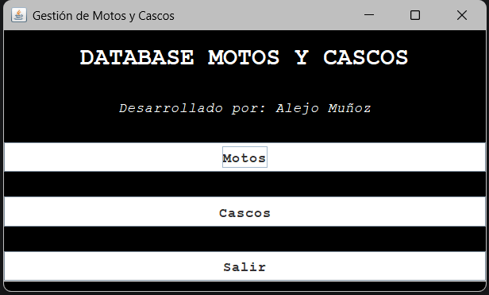
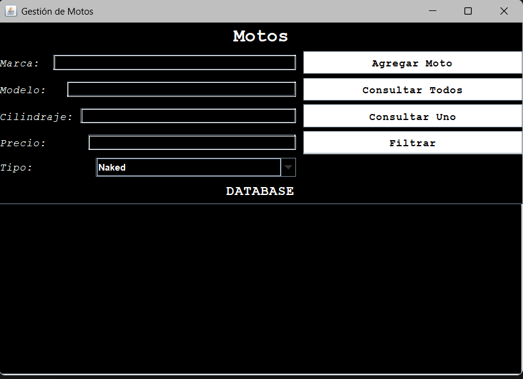
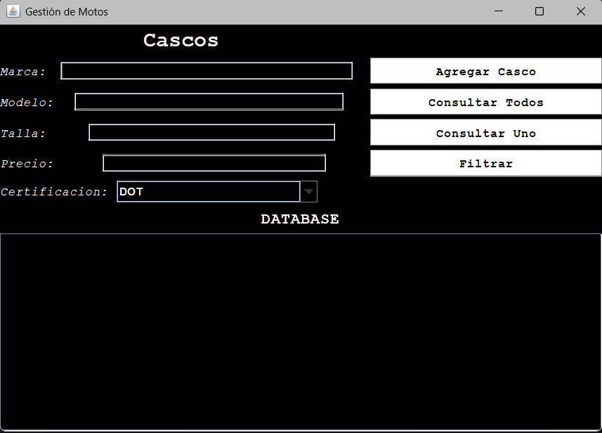

# Parcial II - POO

## Descripción

Proyecto desarrollado en Java con persistencia en base de datos PostgreSQL usando Neon.

La aplicación permite gestionar información de dos modelos relacionados con el mundo del motociclismo:

- Motos
- Cascos

Se implementó conexión remota a base de datos, patrón DAO y menú interactivo en consola para realizar operaciones CRUD básicas y filtros personalizados.


## Modelos implementados

### Moto
Permite registrar información relacionada con motocicletas.

Atributos:

- id
- marca
- modelo
- cilindraje
- precio
- tipo

Operaciones:

- Adicionar moto
- Consultar una moto
- Consultar todas las motos
- Filtrar por tipo

---

### Casco
Permite registrar información relacionada con cascos de motocicleta.

Atributos:

- id
- marca
- modelo
- talla
- certificacion
- precio

Operaciones:

- Adicionar casco
- Consultar un casco
- Consultar todos los cascos
- Filtrar por presupuesto máximo


## ¿Qué se utilizó?

- Java
- PostgreSQL
- Neon Database
- IntelliJ IDEA
- Git y GitHub


## Estructura del proyecto

```text
src
  DB
    DBConnection.java
    TestConnection.java
  DAO
    MotoDAO.java
    CascoDAO.java
  Modelado
    Moto.java
    Casco.java
  menu
    Menu.java
Main.java
```


## DAO

Se implementó el patrón DAO (Data Access Object) para separar la lógica de acceso a base de datos de la lógica del programa.

DAO implementados:

- MotoDAO
- CascoDAO

Esto permite:

- Mejor organización
- Separación de responsabilidades
- Código más mantenible


## Gestión de conexión

La conexión a la base de datos se realiza mediante la clase:

```java
DBConnection
```

Las credenciales se almacenan en un archivo externo:

```text
credenciales.properties
```

Este archivo está excluido del repositorio mediante:

```text
.gitignore
```

para evitar exponer información sensible.


## Base de datos

Se utilizó PostgreSQL en un servidor remoto mediante Neon.

Tablas creadas:

- moto
- casco


## Cómo ejecutar

1. Clonar el repositorio
2. Abrir el proyecto en IntelliJ IDEA
3. Descargar el driver JDBC de PostgreSQL
4. Crear el archivo:

```text
credenciales.properties
```

con la siguiente estructura:

```properties
url=TU_URL
usuario=TU_USUARIO
password=TU_PASSWORD
```

5. Ejecutar Main.java


## Funcionalidades principales

### Motos

- Insertar
- Consultar uno
- Consultar todos
- Filtrar por tipo

### Cascos

- Insertar
- Consultar uno
- Consultar todos
- Filtrar por presupuesto

---

## GUI

# Ventana Principal

# Ventana Moto

# Ventana Casco

---

## Desarrollado por

Alejandro Muñoz estudiante de primer semestre de ingeniería eléctrica de la Universidad Distrital

Proyecto desarrollado para la asignatura Programación Orientada a Objetos.
